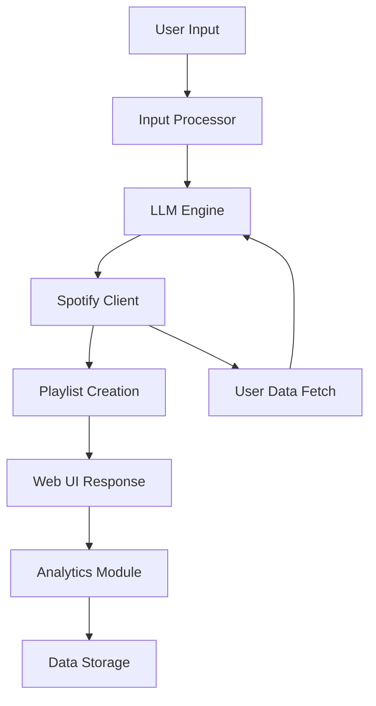

# LLM Spotify Playlist Generator - Project Plan

## Project Overview
This project aims to build an AI-powered Spotify playlist generator that leverages Large Language Models (LLMs) to create personalized playlists based on natural language descriptions. The system will interpret user inputs (e.g., "upbeat workout music" or "relaxing jazz for a rainy day"), query the Spotify API for relevant tracks, and use LLMs to curate and order songs into cohesive playlists. To align with the Mercor job requirements, we'll incorporate reinforcement learning (RL) elements for optimizing recommendations, containerize the application with Docker, and set up CI/CD pipelines.

### Key Objectives
- Demonstrate proficiency in LLMs, RL, and infrastructure management
- Build a functional, deployable application with clear documentation
- Showcase ability to handle ambiguous requirements and research-oriented tasks
- Create a GitHub repository with reproducible setups

### Added Ideas
- **User Data Integration**: Query user's Spotify data (e.g., top tracks, listening history) to provide personalized context for LLM generation.
- **Song Embeddings**: Use vector embeddings (via Hugging Face or similar) to measure song similarity and improve curation.
- **Multi-modal Input**: Allow users to input text, images (e.g., mood boards), or even voice descriptions.
- **Analytics Dashboard**: Include data preprocessing and analytics for playlist performance metrics.
- **Scalable Architecture**: Design for extensibility, such as integrating multiple LLMs or adding collaborative playlist features.

## Features
1. **Natural Language Processing**: Parse user descriptions to extract themes, moods, genres, and constraints.
2. **Spotify Integration**: Authenticate with Spotify API, search for tracks, create/manage playlists, and fetch user data (e.g., top tracks).
3. **LLM-Powered Curation**: Use LLMs to select tracks, generate playlist names, and order songs logically, incorporating user data for personalization.
4. **Web Interface**: Simple UI for inputting descriptions and viewing generated playlists.
5. **Data Analytics**: Collect and analyze playlist data for insights (e.g., genre popularity).
6. **Containerization**: Docker setup for easy deployment and environment management.
7. **CI/CD**: GitHub Actions for automated testing, building, and deployment.

## Tech Stack
- **Programming Language**: Python (core for ML and scripting)
- **LLMs**: OpenAI GPT API or Hugging Face Transformers (e.g., GPT-2/3 for local inference)
- **APIs**: Spotify Web API for music data
- **Web Framework**: FastAPI for REST API and simple web UI
- **Data Processing**: Pandas, NumPy for analytics; Scikit-learn for preprocessing
- **Embeddings**: Sentence Transformers or Hugging Face for text/song similarity
- **Infrastructure**: Docker for containerization; GitHub Actions for CI/CD
- **Version Control**: GitHub with branching strategy
- **Other**: Requests for API calls; Pytest for testing

## Architecture
The application follows a modular, microservices-inspired architecture for scalability.

### High-Level Components
- **Input Processor**: Handles user input (text/image/voice) and preprocesses it.
- **LLM Engine**: Processes natural language and user data to generate playlist criteria.
- **Spotify Client**: Interfaces with Spotify API for track search, playlist creation, and user data retrieval.
- **Analytics Module**: Processes and visualizes playlist data.
- **Web API**: Exposes endpoints for the UI and external integrations.

### Data Flow
1. User submits a description via the web interface.
2. Input Processor extracts features (e.g., mood, genre).
3. Spotify Client fetches user data (e.g., top tracks) for personalization.
4. LLM Engine generates a playlist theme and track suggestions using user input and data.
5. Spotify Client queries for matching tracks and creates the playlist.
6. Playlist is returned to the user.
7. Analytics Module logs data for future improvements.

### Mermaid Diagram: System Architecture

## Implementation Steps
1. **Project Setup**: Initialize GitHub repo, set up virtual environment, and define project structure.
2. **Spotify API Integration**: Implement authentication, track search, and user data retrieval.
3. **LLM Integration**: Set up LLM API calls for text processing and playlist generation.
4. **Core Logic**: Build the playlist generation algorithm combining LLM, user data, and Spotify tracks.
5. **Web Interface**: Develop a basic UI for user interaction.
6. **Data Analytics**: Implement data collection and visualization.
7. **Containerization**: Create Dockerfiles and docker-compose for the application.
8. **CI/CD Setup**: Configure GitHub Actions for testing and deployment.
9. **Testing and Documentation**: Write unit tests, integration tests, and comprehensive README.
10. **Deployment**: Deploy to a cloud platform (e.g., Heroku or AWS) for demonstration.

## Risks and Mitigations
- **API Limits**: Spotify API has rate limits; implement caching and batching.
- **LLM Costs**: Use local models or free tiers; monitor usage.
- **RL Complexity**: Start with a simple Q-learning agent to avoid over-engineering.
- **Data Privacy**: Ensure user data is handled securely; no storage of sensitive info.

## Success Metrics
- Functional playlist generation from various inputs.
- RL model shows improvement in user satisfaction over iterations.
- Clean, documented code with >80% test coverage.
- Successful Docker deployment and CI/CD pipeline.

This plan positions the project as a strong demonstration of ML, infrastructure, and research skills relevant to the Mercor role.